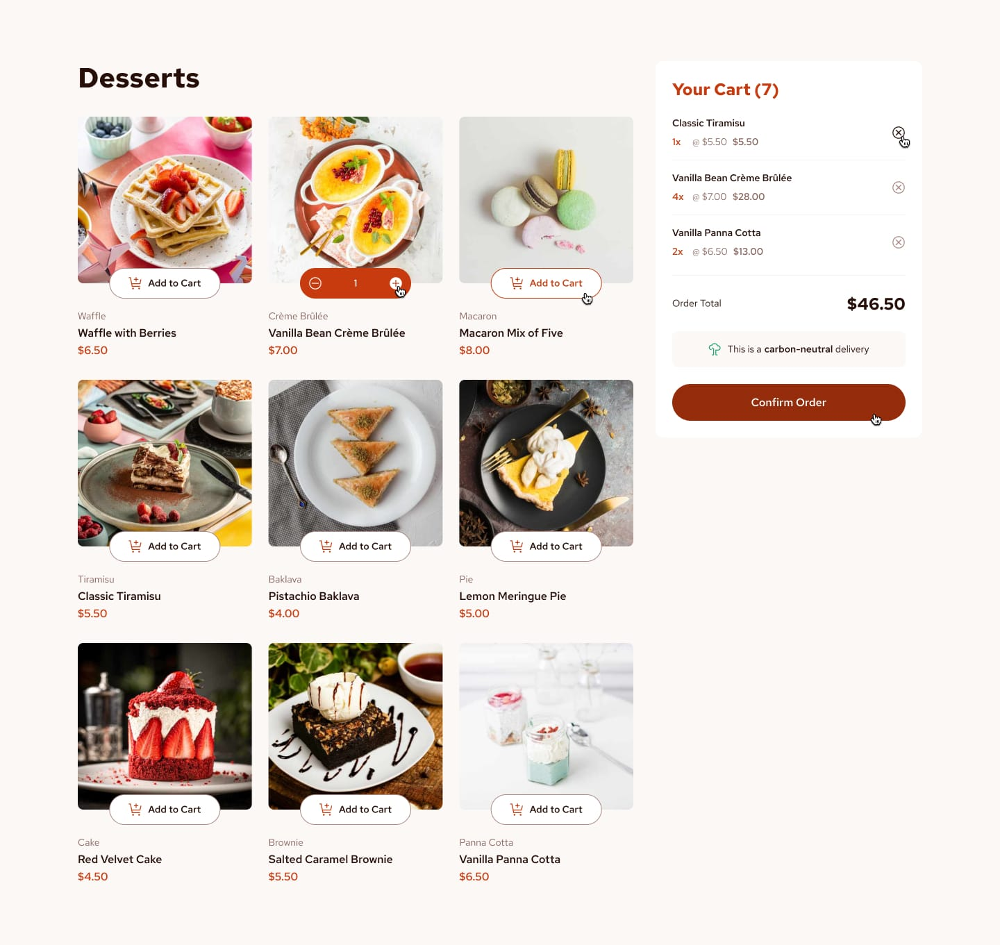

# Dessert Cart

Product List with Cart is a responsive dessert ordering application built with React, Redux Toolkit, Tailwind CSS, and Axios. Users can browse desserts, manage their cart, update quantities, and confirm their orders through a clean and intuitive interface.


## Features

- Product listing
- Shopping cart management
- Dynamic quantity updates
- Order confirmation modal
- Responsive layout
- State management with Redux Toolkit
- API data fetching with Axios

## Tech Stack

- React
- Redux Toolkit
- JavaScript (ES6+)
- CSS / Tailwind CSS
- Vite

## Getting Started

### Prerequisites

- Node.js (v18 or later)
- npm

### Installation

```bash
git clone https://github.com/your-username/dessert-cart.git
cd dessert-cart
npm install
npm run dev
```

## Project Structure

```text
src/
├── assets/
├── components/
│   ├── cart/
│   └── products/
├── controls/
├── store/
├── App.jsx
└── main.jsx
```

## Screenshots

<p align="center">
  
  
</p>

## Live Demo

<p align="center">
  <video src="screenshots/demo..mp4" width="150px" />
</p>

## Acknowledgements

This project was built as a frontend coding challenge to practice React, Redux Toolkit, and responsive UI development.
